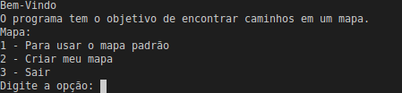
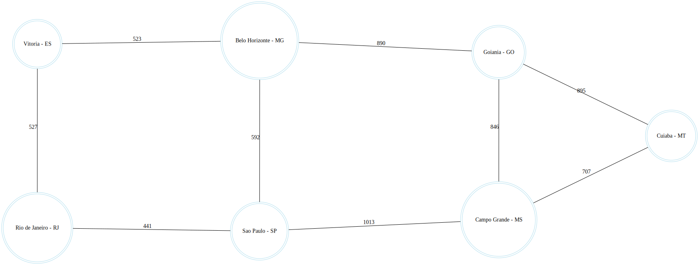
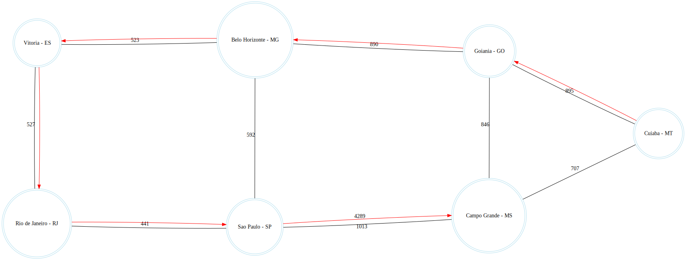

# Projetor de rota
Temas:
 - Grafos2

**Número da Lista**: 2 
**Conteúdo da Disciplina**: Grafos 2 

## Alunos
|Matrícula | Aluno |
| -- | -- |
| 17/0080366  |  Moacir Mascarenha |
| 15/0062567  |  Marcos Adriano Nery |

## Sobre 

### Problema
O projeto tem a capacidade de construir mapas simples e interpreta-los como grafo, direcionados ou não, o mesmo possui um mapa padrão além de fornecer ao usuário a possibilidade da construção de um mapa personalizado. A partir do mapa o algoritmo irá traçar uma rota com a menor distância possível de um local de partida para ir até o destino indicado, permitindo ao usuário incluir pontos de paradas, sendo levado em consideração a prioridade a indicada pela ordem de entrada. Na saida é apresentado graficamente no grafo quais cidades foram visitadas, estradas foram utilizadas e o caminho total percorrido a depender da unidade de medida utilizada.

### Algoritmo Dijkstra
O Algoritmo de Dijkstra soluciona o problema do caminho mais curto num grafo dirigido ou não dirigido com arestas de peso não negativo. De forma prática se alguém precisa se deslocar de uma cidade para outra, mesmo que o trajeto tenha várias possiveis estradas, que passam por diversas cidades, o algoritmo dirá qual o caminho mais curto e quais estradas deve-se tomar.

### Algoritmo de Prim
O algoritmo de Prim é um algoritmo especialmente utilizado para encontrar uma árvore geradora mínima num grafo conectado, valorado e não direcionado. Assim o algoritmo encontra um subgrafo no qual a soma total das arestas é minimizada e todos os vértices estão interligados.

## Screenshots
### Menu

### Mapa

### Rota (com paradas)

## Instalação 
**Linguagem**: Python 

#### Requisitos
- python3 instalado
- Biblioteca graphviz instalada
    
        pip install graphviz

## Uso 

[Instruções em video](https://www.dropbox.com/s/w1eplr78krg9ph8/projalgoritmos%20on%202020-10-03%2001-42.mp4?dl=0)

### Rodar a Aplicação
    1° Entre na pasta ProjetorDeRota
    2° Execute: python3 menu.py
        3° Escolhas a opção para o mapa
        4° Aguarde a imagem ser gerada
        5° Precione enter para continuar
        6° Esolha a opção para gerar o tipo de caminho
        7° Aguarde a imagem ser gerada
        8° Precione enter para finalizar

## Referências

> Algoritmo de Dijkstra. Disponível em: https://pt.wikipedia.org/wiki/Algoritmo_de_Dijkstra

> Algoritmo de Prim. Disponível em: https://pt.wikipedia.org/wiki/Algoritmo_de_Prim

> Como resolver o problema do caminho mais curto usando a técnica best-first branch and bound?. Disponível em:http://prorum.com/?qa=2482/resolver-problema-caminho-curto-usando-tecnica-first-branch

> Graphviz - Graph Visualization Software. Disponível em: https://graphviz.org/ 

> Colorindo grafos. Disponível em: https://pythonhelp.wordpress.com/2015/01/02/colorindo-grafos-ou-como-escolher-cores-para-um-mapa-automaticamente/

